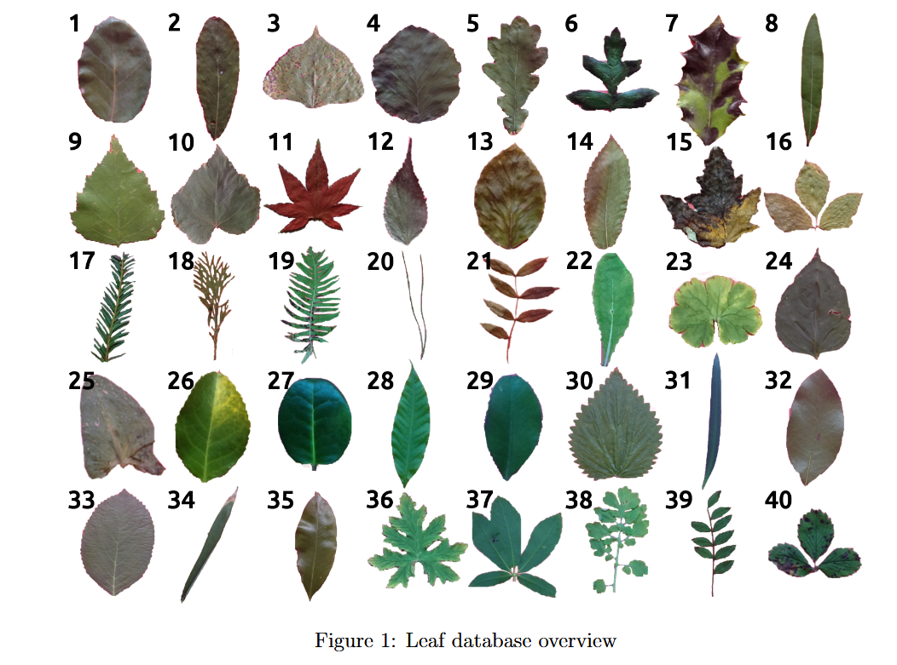
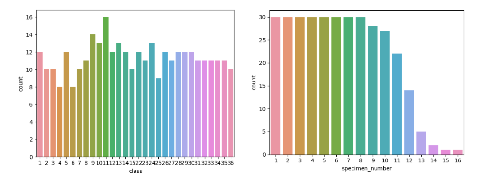

# Plantis

Plantis is a supervised machine learning project for multiclass leaf classification. It uses structured leaf features to compare traditional machine learning models in a simple, interpretable, and practical way. The project explores how models such as Logistic Regression, Support Vector Machine, and Random Forest perform on handcrafted morphological and statistical leaf attributes, rather than image-based inputs. The goal of this project is to develop a method for leaf identification based on the provided leaf attributes and to compare the performance of different supervised machine learning models. This project was built as part of Master degree program at University of Trieste for Introduction to Machine Learning course (2022-2023).

<div align="center">
  
</div>

## Repository Structure

```text
Plantis/
├── README.md
├── .gitignore
├── report.pdf
├── data/
│   └── ReadMe.pdf
├── notebooks/
│   ├── 01_eda.ipynb
│   └── 02_models.ipynb
└── assets/
    └── images/

```
    
## Dataset

The dataset contains **340 samples** and **16 columns**, including the target variable `class`. The features describe different geometric and statistical properties of leaves, such as shape, texture, and intensity-related measures. The dataset includes **36 unique classes** and **16 unique specimen numbers**.

## Exploratory Data Analysis

Before training the models, the dataset was explored to understand feature behavior and data quality. The analysis showed that many features were skewed and contained outliers, which made preprocessing an important step. Another key observation was that the target classes were not evenly distributed, meaning the dataset was imbalanced. This had a direct impact on model selection and evaluation. 

<div align="center">
  
</div>

## Methods

Since the dataset is relatively small, the project focuses on simpler supervised learning methods rather than highly complex models. The following approaches were tested:

- Logistic Regression
- Logistic Regression with balanced class weights
- Random Forest Classifier
- Random Forest with hyperparameter tuning
- Support Vector Machine
- One-vs-Rest Support Vector Machine

The models were trained and compared with special attention to the imbalance in the dataset. In particular, balancing class weights helped improve Logistic Regression, while Random Forest performed well even in its default form.

## Evaluation

Because the dataset is imbalanced, accuracy alone is not a reliable measure of performance. For that reason, the project gives more importance to:

- Precision
- Recall
- F1-score
- Macro average
- Weighted average

These metrics give a more meaningful picture of how well the models perform across all classes, especially the minority ones. 

## Results

Among the models tested, the strongest results came from:

- **Random Forest Classifier**
- **Logistic Regression with balanced class weights**

These models performed better overall than the default Logistic Regression and SVM-based approaches, especially when considering the more informative evaluation metrics beyond accuracy that better reflect performance across all 36 leaf classes, especially the underrepresented ones.. 

## Challenges and Conclusion

One of the main difficulties in this project was handling the imbalance in the target classes. An attempt was made to use SMOTE for oversampling, but this led to an error because some minority classes had too few examples to support the required nearest-neighbor interpolation. Plantis shows that traditional supervised machine learning models can perform well on leaf classification when the data is handled carefully and evaluated with the right metrics. In this project, Random Forest and class-weighted Logistic Regression gave the most reliable results. The work also highlights an important lesson: when a dataset is imbalanced, accuracy can be misleading, and metrics such as precision, recall, and F1-score provide a much more honest view of model performance. 
